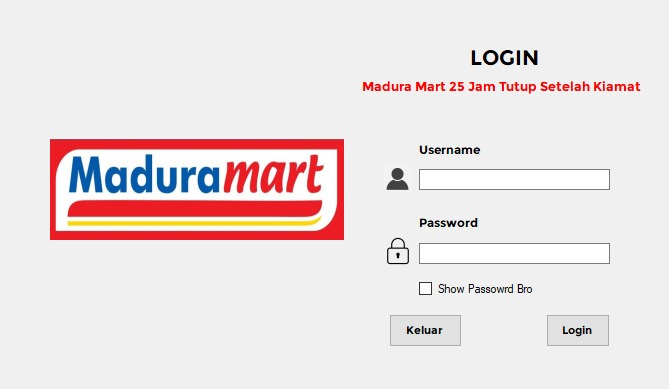

# Desktop Application Development Using MVC Architecture (Penjualan Madura Mart)


## 📌 Deskripsi Proyek
Aplikasi ini merupakan **aplikasi desktop penjualan** yang dikembangkan menggunakan **VB.NET (Visual Basic .NET)** dengan menerapkan **arsitektur Model–View–Controller (MVC)**.  
Aplikasi dirancang untuk membantu proses pengelolaan data penjualan pada **Madura Mart**, meliputi pengelolaan data master, transaksi penjualan, serta laporan.

Penerapan arsitektur MVC bertujuan untuk memisahkan logika bisnis, tampilan antarmuka, dan pengolahan data agar sistem lebih **terstruktur, mudah dipelihara, dan mudah dikembangkan**.

---

## 🎯 Tujuan Pengembangan
- Menerapkan konsep **MVC Architecture** pada aplikasi desktop
- Membuat sistem penjualan yang terstruktur dan mudah digunakan
- Membantu pengelolaan data penjualan secara terkomputerisasi
- Sebagai **proyek UAS Mata Kuliah Pemrograman Desktop**

---

## 🧱 Arsitektur MVC
Aplikasi ini dibangun dengan pembagian komponen sebagai berikut:

### 1️⃣ Model
Berfungsi untuk:
- Mengelola koneksi database
- Menangani proses CRUD (Create, Read, Update, Delete)
- Mengelola logika bisnis dan query SQL

### 2️⃣ View
Berfungsi untuk:
- Menampilkan antarmuka pengguna (Form VB.NET)
- Menerima input dari pengguna
- Menampilkan data dari controller

### 3️⃣ Controller
Berfungsi untuk:
- Menjembatani komunikasi antara Model dan View
- Memproses input dari View
- Menentukan logika alur aplikasi

---

## ⚙️ Fitur Aplikasi
- Login pengguna
- Pengelolaan data master (produk, supplier, pelanggan)
- Transaksi penjualan
- Pengelolaan stok barang
- Laporan penjualan
- Koneksi database menggunakan MySQL

---

## 🛠️ Teknologi yang Digunakan
- **Bahasa Pemrograman**: VB.NET
- **Framework**: .NET Framework
- **Database**: MySQL
- **IDE**: Visual Studio
- **Arsitektur**: MVC (Model–View–Controller)

---

## 📁 Struktur Proyek

    WindowsApplication1/
    ├─ controllers/
    │  ├─ CategoryController.vb
    │  ├─ ItemController.vb
    │  ├─ PurchaseController.vb
    │  ├─ PurchaseReportController.vb
    │  ├─ SaleController.vb
    │  ├─ SalesReportController.vb
    │  └─ UserController.vb
    │
    ├─ models/
    │  ├─ Category.vb
    │  ├─ Item.vb
    │  ├─ Purchase.vb
    │  ├─ PurchaseDetail.vb
    │  ├─ PurchaseReport.vb
    │  ├─ Sale.vb
    │  ├─ SaleDetail.vb
    │  ├─ SalesReport.vb
    │  ├─ Session.vb
    │  ├─ Supplier.vb
    │  └─ User.vb
    │
    ├─ views/
    │  ├─ category/
    │  │  └─ frmAddCategory.vb
    │  ├─ items/
    │  │  ├─ frmItemInput.vb
    │  │  └─ frmListItem.vb
    │  ├─ purchase/
    │  │  └─ frmPurchase.vb
    │  ├─ sale/
    │  │  └─ frmSale.vb
    │  ├─ supplier/
    │  │  └─ frmSupplier.vb
    │  ├─ users/
    │  │  └─ frmUsers.vb
    │  └─ Report/
    │     ├─ purchase/
    │     │  └─ FormPurchaseReport.vb
    │     └─ sales/
    │        └─ FormSalesReport.vb
    │
    ├─ Reports/
    │  ├─ ReportPurchase.rdlc
    │  └─ SalesReport.rdlc
    │
    ├─ DataSet1.xsd
    ├─ frmLogin.vb
    ├─ frmSetting.vb
    ├─ frmUtama.vb
    ├─ Koneksi.vb
    ├─ Autentikasi.vb
    ├─ Main.vb
    ├─ App.config
    └─ packages.config


---

## 🗄️ Database
File database tersedia pada:

Database ini berisi tabel-tabel yang digunakan untuk mendukung proses penjualan, seperti:
- category
- items
- products
- purchase
- purchasedetail
- sale
- saledetail
- supplier
- users

---

## ▶️ Cara Menjalankan Aplikasi
1. Clone repository ini:
   ```bash
   git clone https://github.com/achill75/DESKTOP-APPLICATION-DEVELOPMENT-USING-MVC-ARCHITECTURE-PENJUALAN-.git
Buka file .sln menggunakan Visual Studio
2. Import database dbpenjualan-madura-mart.sql ke MySQL
3. Atur koneksi database pada aplikasi
4. Jalankan aplikasi dengan menekan Start

👩‍🎓 Konteks Akademik

Proyek ini dibuat untuk memenuhi Ujian Akhir Semester (UAS) mata kuliah Pemrograman Desktop, dengan fokus pada penerapan arsitektur MVC dalam pengembangan aplikasi desktop.

📄 Lisensi

Proyek ini dibuat untuk keperluan akademik dan pembelajaran.

